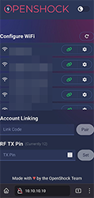
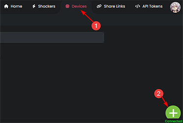
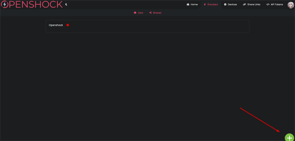

# First time setup

!!! danger "Safety Warning"
    **Don't wear the shocker somewhere near your neck or your heart.**  
    Check out [Safety](../safety/safety-rules.md) for more information.

## What you need

- USB cable suitable for your device.
- A stable power source. Try to avoid cheap power bricks, they can cause the device to crash under certain loads.
- A smartphone with a web browser (Chrome, Firefox etc.)
- [OpenShock hub](../hardware/boards/index.md)
- [Shocker](../hardware/shockers/index.md)
- [OpenShock account](https://openshock.app/)

## Setup the OpenShock hub

1. Connect your **Phone** to the hub:
    1. Plug your hub in and ensure it has power.
    2. On your phone, search for a Wi-Fi network named similar to ``OpenShock-24:DC:C3:9F:72:C8`` and connect to it.  
    ??? Info "Image"
        
2. Connect to the hub via the network:
    1. Open your phone's browser and type in ``10.10.10.10`` *or* ``openshock.local`` this should open up a web-interface for the hub.
    2. Find your router's Wi-Fi network in the web-interface.
    3. Press the green button next to it and type in your Wi-Fi password, then press submit.
    *A green pop up should appear if it's connected successfully*
    ??? Info "Image"
        
3. Create a hub on the website:
    1. **On your PC** open [OpenShock.app](https://openshock.app/).
    2. Create an account. *(If you don't have one already)*
    3. Go to **Devices** and click the **green plus icon** at the lower right corner to create a new hub.
    4. Give it a name:
        1. Open the context menu of the hub. *(the three dots next to the newly created hub)*
        2. Select **edit**.
        3. Type in a name, *(your name for example)* into the name field.
        4. Press save.
    ??? Info "Images"
        
        
        
4. Pair the hub:
    1. Open the context menu of your hub again.
    2. Select **pair** and press **get pair code**, this will generate a new pair code.
    3. On your phone type the code into the account Linking field of the hub's web-interface, then press **pair**.
        - After you linked the hub to your account it should shut down it's own Wi-Fi network.
    ??? Info "Images"
        
        
5. The hub is now connected!
    - If everything went well, it should show a **green icon** next to the device name on the website.
    ??? Info "Image"
        
!!! warning "RF TX Pin"
    **DO NOT** change the RF TX Pin, this is an advanced feature. It should be set correctly by default after flashing the OpenShock firmware. For more information see the page dedicated to your micro-controller under [boards](../hardware/boards/index.md).

## Pair a shocker

1. Ensure the shocker is sufficiently charged.
2. Ensure your hub is connected to the website. ([Setup the OpenShock hub](#setup-the-openshock-hub))
3. Create a Shocker.
    1. Go to [OpenShock.app](https://openshock.app/)
    2. Login if you are not already.
    3. Navigate to **Shockers**.
    4. Press the **green plus icon** at the bottom right corner.
    5. Select the hub you created earlier.
    6. Give your new shocker a name.
    7. Select the **model** of shocker.
    8. Click **Create**
    ??? info "Images"
        
        
4. Pair your Shocker.
    1. Grab your shocker and turn it on. (Hold the power button for 1 sec. it should beep once.)
    2. Hold the power button again until it beeps and the LED flashes fast. *This means the pair mode is active*
    3. On the website click the ***speaker icon*** of your shocker, if your shocker now makes a sound, the pairing was successful.
    ??? Info "Image"
        
**Everything should work now, have fun!** 🎉  

!!! question "Need Help?"
    If you need additional help, join our [Discord](https://discord.gg/OpenShock)

!!! Info
    Your shocker will remember the device, there is no need to pair it every time.
