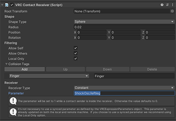
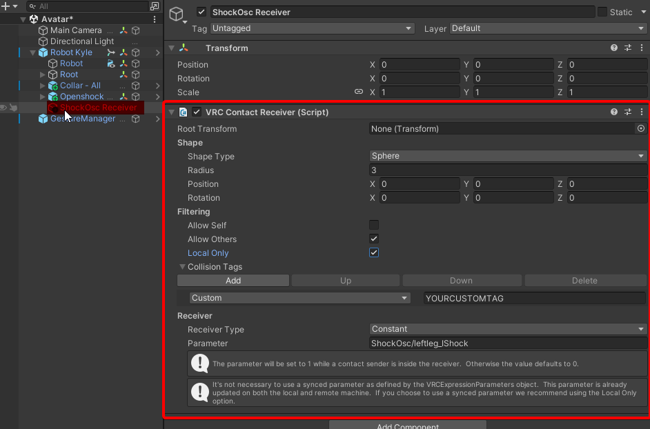
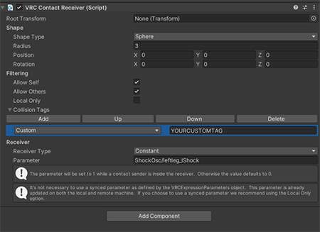
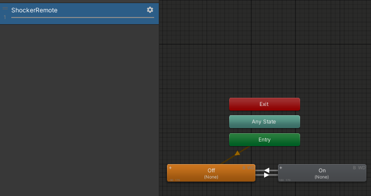
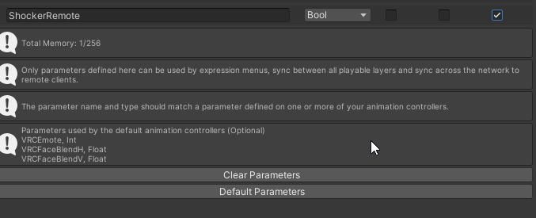

# VRChat Avatar Setup 
  
## What you need
- [ShockOsc](shockosc-basic.md)
- A VRChat avatar
- Basic experience in working with VRChat avatars is recommended

  

## Touch trigger
1. Open your avatars unity project.
2. Add the Touch Trigger
    1. Create a new **Empty GameObject** on the bone you want your trigger to be at, your LeftLeg for example. 
        1. *Right-Click the bone.*
        2. *Select "Create Empty".*
    ??? Info "Image"  
        
    1. Select the new GameObject.
    2. Rename it to whatever you want. *For example "ShockOSC"* 
    3. Add a new ``VRC Contact Receiver`` component to it.
    4. Position the object on your avatar.
    ??? Info "Image"  
          
3. Configure the **VRC Contact Receiver** component:  
    - **Radius** : That's the range of the trigger, don't make it too big otherwise people will constantly trigger it by accident.
    - **Filtering**: ``Local Only`` should definetily be used, but it's on you if you use ``Allow Self``, ``Allow Others`` or both of these. This will decide if other people or you can trigger the shocker by touching it.
    - **Collision Tags**: I recommend that you at least use the ``Finger`` Tag, otherwise people can't touch the trigger with their fingers, but is's up to you what kind of tags you use.
    - **Receiver Type**: this needs to be set to ``constant``.
    - **Parameter**: ``ShockOsc/{GroupName}``  
      Replace *{GroupName}* with the name you gave your shocker in the [ShockOsc config](./shockosc-basic.md#setup-shockosc).  
      Example: ``ShockOsc/leftleg``.  
    !!! example "Example"
          
        
4. Upload your Avatar and you are ready to go! 🎉  

!!! bug "Activate OSC"
    Make sure that you have [enabled OSC](https://docs.vrchat.com/docs/osc-overview#enabling-it) inside VRChat.  

!!! Tip "Avatar Update Info"
    If you update an existing avatar, make sure you delete the OSC config files in ``C:\Users\%USERPROFILE%\AppData\LocalLow\VRChat\VRChat\OSC``, they are not important for the game since they only hold the avatar parameters for OSC to use, they get regenerated every time you change your avatar, but VRChat fails to update them sometimes when a new parameter got added to an Avatar. 

    Reload your Avatar after that.

  

## Remote trigger  
This will utilize the Contact Sender and Receiver components of the VRChatSDK to make it possible to trigger a shock without touching your Avatar, like a remote.  

### Create a Receiver
1. Open your Avatars Project
2. Create a Receiver
    1. In the Hierarchy right click your Avatar
    2. Click *Create Empty* to create a new GameObject
    3. Rename it to something like "ShockOsc Receiver".
    4. Select the newly created object and go into the inspector, click on *Add Component* and add a ``VRC Contact Receiver`` component to the object.
3. Setup the Receiver
    1. Increase the Range of the component (max. 3m, that's a limit enforced by VRChat)
    2. Check, Allow Others and Local Only
    3. Uncheck Allow Self
    4. Add a Collision Tag
    5. Set the Collision Tag to *Custom*
    6. Set a Custom Tag
        1. I recommend generating a password with a password generator, **don't use a real password!** This password needs to be shared with the people that should be able to trigger your receiver.
    7. Set the receiver type to constant
    8. Set the Parameter: ``ShockOsc/{GroupName}_IShock``(bool),alternatively you can use ``ShockOsc/_All_IShock``(bool) to trigger all your shockers at the same time.
      Replace *{GroupName}* with the name you gave your shocker in the [ShockOsc config](./shockosc-basic.md#setup-shockosc).  
      Example: ``ShockOsc/leftleg_IShock``.  
    
    ??? example
          

### Create a Sender
1. Open your partners Avatar project.
2. Create a Sender
    1. In the Hierarchy right click your Avatar
    2. Click *Create Empty* to create a new GameObject
    3. Rename it to something like "ShockOsc Sender".
    4. Select the newly created object and go into the inspector, click on *Add Component* and add a ``VRC Contact Sender`` component to the object.
3. Setup the Sender
    1. Increase the Range of the component (max. 3m, that's a limit enforced by VRChat)
    2. Add a Collision Tag
    3. Set the Collision Tag to *Custom*
    4. Set a Custom Tag
        1. this needs to be the same tag as the one in the Receiver!
    5. Create a Toggle for it in the FXLayer.
        1. Open your Avatar FX Layer Animator
        2. Go to the Parameter Tab and create a new Bool parameter
        3. Name the new Bool Parameter however you want, maybe something like "ShockerRemote"
        4. Switch to the Layer tab of the Animator and Create a new Layer.
        5. Name the layer something like "Shocker Remote"
        6. Create 2 new states inside the layer and name them On and Off and set Off as the default layer state (Orange).
        
        7. Create 2 new Animations, one that toggles the Sender object On an one that turns it Off, then assigns the animations to the right states you created earlier.
        8. Create 2 Transitions one from On to Off and one from Off to On.
        9. Both transitions should **not** have a transition time greater then 0 and they should have **no** Exit time.
        10. In both transitions set your Bool Parameter created earlier as a condition, from On to Off should be ``false`` and Off to On should be ``true``
        
    6. Create the Toggle in the Action Menu.
        1. Open your avatars Parameter list and add your earlier created bool parameter to it
        
        2. uncheck the "Saved" option and also the "default" option  
        3. Open your Avatar Menu file and go to the place you want to add the Button for the Remote to.
        4. Create a new entry, give it a name "Shocker Remote" for example. Make sure it's set to Button and then add your Parameter to it.
        

### Upload your Avatars
!!! Bug "Important"
    Both avatars can now be uploaded, the Receiver Avatar should also delete their VRChat OSC config (``C:\Users\%USERPROFILE%\AppData\LocalLow\VRChat\VRChat\OSC``) to make sure that the newly added IShock parameter is used by OSC.  
  
    Also make sure you have interactions enabled ingame otherwise contacts won't work!
  

  

## Pull trigger
!!! info "Still brewing!"

    Sorry, we haven't _quite_ gotten around to writing this set of articles just yet. **In the meantime, feel free to hit us up on [Discord](https://discord.gg/AHcCbXbEcF).**

  

## List of available parameters

=== "Avatar Dynamic Parameters "
    !!! Info "``ShockOsc/{GroupName}`` (bool)"
        when set to ``true`` and held, will trigger a normal shock in ShockOSC
        

    !!! Info "``ShockOsc/{GroupName}_Stretch`` (float)"  
        can be used to control the shock intensity  
        (ex. stretch a bone to 50% and let go to get shocked for 50% intensity)  

    !!! Info "``ShockOsc/{GroupName}_IsGrabbed`` (bool)"   
        mainly used  to indicate that a Physbone is grabbed

    !!! Info "``ShockOsc/{GroupName}_IShock``  (bool)" 
        if set to ``true`` will shock immediately ignoring the configurated ``HoldTime``.  

=== "Visual Parameters"
    !!! Info "``ShockOsc/{GroupName}_Active`` (bool)"
        can be used to display an active shock on your avatar (when the shocker is active, ShockOSC will set this to ``true`` if not it will be ``false``)

    !!! Info "``ShockOsc/{GroupName}_Cooldown`` (bool)"
        can be used to read out if the shocker is on cooldown  

    !!! Info "``ShockOsc/{GroupName}_CooldownPercentage`` (float)"
        Reads out the shocker cooldown, 1 means cooldown and 0 means no cooldown.  
        can be used to make a cooldown timer for example.  
        
    !!! Info "``ShockOsc/{GroupName}_Intensity``  (float)"
        represents how close the shock was to your configured max intensity.

=== "Dummy Shockers"  
    !!! Info "``_All``"
        can be used in place of a group name, **represents all** shockers on your account.  
        (ex: if **ShockOsc/_All** is set to ``true`` on you Avatar, all of your shockers will be triggered at the same time)

    !!! Info "``_Any``"
        can be used in place of a group name, **represents any** shocker on your account.  
        (ex: if at least one of your shockers are currently shocking **ShockOsc/_Any_Active** will be ``true``)  

=== "Config Parameters"  
    !!! Info "``ShockOsc/_Config/_All/Paused`` (bool)"
        It's a kind of killswitch, pausing ShockOSC.  

    !!! Info "``ShockOsc/_Config/_All/MinIntensity`` (Float)"
        Sets Minimum Intensity for the Random Mode.

    !!! Info "``ShockOsc/_Config/_All/MaxIntensity`` (Float)"
        Sets Maximum Intensity for the Random Mode.  

    !!! Info "``ShockOsc/_Config/_All/MinDuration`` (Float)"
        Sets Minimum Duration for the Random Mode.  

    !!! Info "``ShockOsc/_Config/_All/MaxDuration`` (Float)"
        Sets Maximum Duration for the Random Mode.  
    
    !!! Info "``ShockOsc/_Config/_All/Duration`` (Float)"
        Sets Duration Time for the Fixed Mode (100% = 10 Sec.) 
    
    !!! Info "``ShockOsc/_Config/_All/Intensity`` (Float)"
        Sets Intensity for the Fixed Mode.
    
    !!! Info "``ShockOsc/_Config/_All/ModeIntensity`` (Float)"
        Toggles between Fixed and Random Intensity Mode (True = Random)  

    !!! Info "``ShockOsc/_Config/_All/ModeDuration`` (Float)"
        Toggles between Fixed and Random Duration Mode (True = Random)   

    !!! Info "``ShockOsc/_Config/_All/CooldownTime`` (Float)"
        Sets the desired cooldown time.  (0 - 100 sec.)

    !!! Info "``ShockOsc/_Config/_All/HoldTime`` (Float)"
        Sets the time needed to hold the trigger to activate a shock.