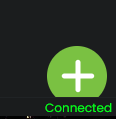
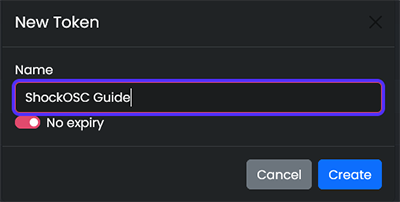
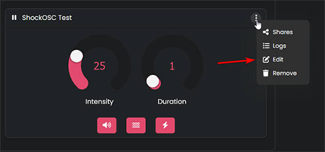

# Basic Setup

!!! danger "Safety Warning"
    **Don't wear the shocker somewhere near your neck or your heart.**  
    Check out [Safety](../safety/safety-rules.md) for more information.  

!!! question "What is ShockOsc?"
    ShockOsc is an application made for Shocklink that uses OSC to trigger your shockers from an in-game command.  
    OSC is a service implemented in VRChat that allows the communication between the game and 3rd party applications.  

## What you need

- [Fully setup shocker](openshock-first-setup.md)
- [Newest ShockOsc](https://github.com/OpenShock/ShockOsc/releases)
- Text editor, Notepad or [Notepad++](https://notepad-plus-plus.org/) for example

<br></br>

## Setup ShockOsc
1. [Download](https://github.com/OpenShock/ShockOsc/releases) and store the ``ShockOsc.exe`` file at your desired location on your PC.  
   (at the moment there are two ShockOsc.exe files to download, you only need the ``OpenShock.ShockOsc.exe``)  
2. Start the .exe for the first time, this will generate a ``config.json`` file in the same location as the .exe, press any button to close the window again.
3. Open ``config.json`` in a text editor, we need to configure two things , your ``API Token`` and your ``Shocker ID``.  
Both can be found in your account on [Shocklink.net](https://shocklink.net/)

??? Info "Configure the API Token"
    1. On [Shocklink.net](https://shocklink.net/) go to ``API Tokens``  
      
    2. Press the ``green plus`` at the bottom.  
      
    3. Give it a name, for example "ShockOSC" and set no expiry date, after that click create.  
      
      
    4. Copy the API Token and paste it into the config at ``"ApiToken":`` then save the config file.  
    After that it should look like this:  
    !!! example
        ```json
        "ApiToken": "0W3ybn7bHuF2SUwAZ8YZexRMejzTcUzJJT3cBSf4FWK7ryLhRT2wikFh8qZGYpiY"
        ```  
        Obviously you should use your own APi Token 😉


??? Info "Configure the Shocker ID"
    1. On [Shocklink.net](https://shocklink.net/) go to ``Shockers``  
      
    2. Open the context menu of the shocker you want to use  
      
    3. Click on edit, and copy the ID  
      
    4. In your config you have to create a list for your shockers, there you have to paste your Shocker ID  
    It should look something like this at the end:  
    !!! example 
        ```json
        ...
        "Shockers": {
          "SHOCKERNAME": "18b1d0e6a-f9a0-4e93-9812-241eae9271791"}
        ...
        ```  
        ``SHOCKERNAME`` can be replaced by your own name for your shocker, ``leg`` for example, the name doesn't need to match the name on Shocklink.net, this name is later used to create a parameter on your avatar.  
              
        (optional) You <u><b>can</b></u> also add more shockers, make sure you don't use the same ID or Name twice, this doesn't work.<br>
        ```json
        ...
        "Shockers": {
          "leftleg": "18b1d0e6a-f9a0-4e93-9812-241eae9271791", 
          "rightleg": "28b1d0e6a-f9a0-4e93-9812-241eae9271792",
          "lefttoe": "38b1d0e6a-f9a0-4e93-9812-241eae9271793"}
        ...
        ```

<br></br>

## Configure Limits
You can also set limits in ShockOsc. 
!!! Tip
    Time is set in milliseconds  
    1 second = 1000 milliseconds  
    
### Random strength and duration
This way you will be shocked for a random strength or random duration or both when someone triggers your ShockOsc.  

1. Open your ``config.json``.
2. Make sure ``RandomIntensity`` and/or ``RandomDuration`` is set to ``true``, you can configure these individually. 
3. Edit the ``IntensityRange`` and ``DurationRange``.
4. Save the config file, you are done!

### Fixed strength and duration
This way you will be shocked for a fixed strength or duration or both when someone triggers you ShockOsc.  

1. Open your ``config.json``.
2. Set ``RandomIntensity`` and/or ``RandomDuration``  to ``false``, you can configure these individually. 
3. Edit the ``FixedIntensity`` and/or ``FixedDuration`` to the fixed value you want.
4. Save the config file, you are done! 🎉  

<br></br>

## Example Config
??? example "Example Config"  
    After following this guide your config should look something like this:  
    ```json
    "Osc": {
        "Chatbox": true,
        "Hoscy": false,
        "SendPort": 9000,
        "HoscySendPort": 9001
      },
      "Behaviour": {
        "RandomIntensity": true,
        "RandomDuration": true,
        "RandomDurationStep": 1000,
        "DurationRange": {
          "Min": 1000,
          "Max": 5000
        },
        "IntensityRange": {
          "Min": 1,
          "Max": 30
        },
        "FixedIntensity": 50,
        "FixedDuration": 2000,
        "HoldTime": 250,
        "CooldownTime": 5000,
        "WhileBoneHeld": "Vibrate",
        "DisableWhileAfk": true,
        "ForceUnmute": false
      },
      "ShockLink": {
        "ApiToken": "0W3ybn7bHuF2SUwAZ8YZexRMejzTcUzJJT3cBSf4FWK7ryLhRT2wikFh8qZGYpiY",
        "Shockers": {
        "leg": "8b1d0e6a-f9a0-4e93-9812-241eae927179"
        }
      },
      "Chatbox": {
        "DisplayRemoteControl": true,
        "HoscyType": "Message"
      }
    }
    ```


!!! Tip "Advanced Configuration"
    On the [ShockOSC repository](https://github.com/OpenShock/ShockOsc) you can see additional configuration examples, but that would go beyond the limits of this simple guide  
