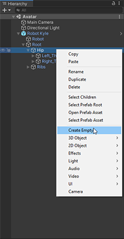
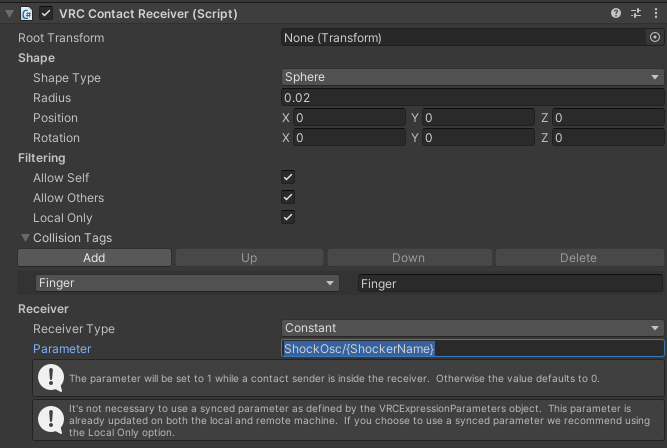

# What you need

1. [Fully setup shocker](../quickstart/first-setup.md)
2. [Newest ShockOSC](https://github.com/OpenShock/ShockOsc/releases)
3. A VRChat avatar
4. Basic Unity knowledge while working with VRChat avatars is recommended
5. Text Editor, [Notepad++](https://notepad-plus-plus.org/) for example

# Setup ShockOSC
1. Download and store the ``ShockOsc.exe`` file at your desired location on your PC.  
   (at the moment there are two ShockOsc.exe files to download, you only need the ``OpenShock.ShockOsc.exe``)  
3. Start the .exe for the first time, this will generate a ``config.json`` file in the same location as the .exe, press any button to close the window again.
4. Now open ``config.json`` in a text editor, now we need two things, your ``Shocklink API Token`` and your ``Shocker ID``. Both can be found in your account on https://shocklink.net/

### Configure the API Token

  On the Shocklink page go to <code>API Tokens</code>. 
   
    
  Press the <code>green plus</code> at the bottom. 
   
    
  Give it a name, for example "ShockOSC" and set no expiry date, after that click create. 
   
    
  Copy the API Token and paste it into the config at <code>"ApiToken":</code>, after that it should look like this: 
  <code>"ApiToken": "0W3ybn7bHuF2SUwAZ8YZexRMejzTcUzJJT3cBSf4FWK7ryLhRT2wikFh8qZGYpiY"</code>. 
   

### Configure the Shocker ID

  On the Shocklink page, go to <code>Shockers</code> 
   
    
  Open the context menu of the shocker you want to use 
   
    
  Click on edit, and copy the ID 
   
  In your config you have to create a list for your shockers, there you have to paste your Shocker ID 
  It should look something like this at the end: 
<code>
  <pre>
      "Shockers": {
        "SHOCKERNAME": "18b1d0e6a-f9a0-4e93-9812-241eae9271791"
      }
  </pre>
</code>
In this example the <code>SHOCKERNAME</code> can be replaced by your own name for your shocker <code>leg</code> for example the name doesn't need to match the name on the website, the name is later used to create a trigger parameter on your avatar. 
  
You can also add multiple shockers or just one, make sure you don't use the same ID twice, this doesn't work. 
<code>
  <pre>
      "Shockers": {
        "leftleg": "18b1d0e6a-f9a0-4e93-9812-241eae9271791", 
        "rightleg": "28b1d0e6a-f9a0-4e93-9812-241eae9271792,
        "nose": "38b1d0e6a-f9a0-4e93-9812-241eae9271793"
      }
  </pre>
</code>

4. Set your limits, of course you can also set limits in ShockOSc as well, for this go inside the ``config.json`` and edit the ``IntensityRange`` and ``DurationRange`` (ShockOSC starts counting at 1, so 100% would be 101 in the config, all time is in milliseconds)
5. Save the config file, you are done!

Start the ShockOsc.exe and keep it open to use it.
*On the [ShockOSC repository](https://github.com/OpenShock/ShockOsc) you can see additional configuration examples, but that would go beyond the limits of this simple guide*

## Example Config  
after following this guide your config should look something like this:  

  <pre>
    <code>
      "Osc": {
          "Chatbox": true,
          "Hoscy": false,
          "SendPort": 9000,
          "HoscySendPort": 9001
        },
        "Behaviour": {
          "RandomIntensity": true,
          "RandomDuration": true,
          "RandomDurationStep": 1000,
          "DurationRange": {
            "Min": 1000,
            "Max": 5000
          },
          "IntensityRange": {
            "Min": 1,
            "Max": 30
          },
          "FixedIntensity": 50,
          "FixedDuration": 2000,
          "HoldTime": 250,
          "CooldownTime": 5000,
          "WhileBoneHeld": "Vibrate",
          "DisableWhileAfk": true,
          "ForceUnmute": false
        },
        "ShockLink": {
          "ApiToken": "0W3ybn7bHuF2SUwAZ8YZexRMejzTcUzJJT3cBSf4FWK7ryLhRT2wikFh8qZGYpiY",
          "Shockers": {
      		"Bzz": "8b1d0e6a-f9a0-4e93-9812-241eae927179"
      	}
        },
        "Chatbox": {
          "DisplayRemoteControl": true,
          "HoscyType": "Message"
        }
      }
    </code>
  </pre>

  

<!---Avatar Setup--->
# How to setup a VRChat avatar with ShockOsc triggers  
## Add a touch trigger to your Avatar
1. Open your avatar project and create a new ``Empty GameObject`` on the bone you want your trigger to be at, your LeftLeg for example.

  

2. Click on the new object and rename it however you want, for example "ShockOSC", after that select it and add a new ``VRC Contact Receiver`` component and position the object on your avatar.

  

3. Configure the components ``Radius``, ``Filtering``, ``Collision Tags`` and of course the ``Parameter``, the parameter need to follow a specific naming scheme. ``ShockOsc/{ShockerName}`` and "{ShockerName}" needs to be replaced by the name you gave your shocker in the ShockOsc config, for example ``ShockOsc/leftleg``.

<code>Or</code>

  
Now upload your Avatar and you are ready to go!
  
*If you update an existing avatar, make sure you delete the OSC config files in ``C:\Users\%USERPROFILE%\AppData\LocalLow\VRChat\VRChat\OSC``, they are not important for the game since they only hold the avatar parameters for OSC to use, they get regenerated everytime you change your avatar, but not always updated*

<!--
## List of available ShockOSC parameters
### Avatar Dynamic Parameters  

``ShockOsc/{ShockerName}`` (bool)  

  when set to <b>true</b> and held, will trigger a normal shock in ShockOSC

  
  
``ShockOsc/{ShockerName}_Stretch`` (float)  

  can be used to control the shock strenght  
  (ex. stretch a bone to 50% and let go to shock someone for 50%)

  

``ShockOsc/{ShockerName}_IsGrabbed`` (bool)   

  mainly used  to indicate that a physbone is grabbed

  
``ShockOsc/{ShockerName}_IShock``  (bool) 

  if set to <b>true</b> will shock immideatly without holding the trigger first  

  

### Visual Parameters
``ShockOsc/{ShockerName}_Active`` (bool)

  can be used to display an active shock on your avatar (when the shocker is active, ShockOSC will set this to <b>true</b> if not it will be <b>false</b>)

  

``ShockOsc/{ShockerName}_Cooldown`` (bool)

  can be used to read out if the shocker is on cooldown  

  

``ShockOsc/{ShockerName}_CooldownPercentage`` (float)

  can be used to show how for long the cooldown is active

    
``ShockOsc/{ShockerName}_Intensity``  (float)

  represents how close the shock was to maximum intensity from <b>IntensityRange</b>

  

### Dummy Shockers  
``_All``

  can be used in place of a shocker name, <b>represents all</b> shockers configured in the ShockOSC config.  
  (ex: if <b>ShockOsc/_All</b> is set to <b>true</b> on you Avatar, every shocker configured in ShockOSC will be triggered at the same time)

  
``_Any``

  can be used in place of a shocker name, <b>represents any</b> shocker configured in the ShockOSC config.  
  (ex: if at least one of your shockers are currently shocking <b>ShockOsc/_Any_Active</b> will be <b>true</b>)

  
  

### Config Parameters  
``ShockOsc/_Config/Paused`` (bool)

  As long as it is <b>true</b>, will pause all ShockOSC activity, shockers will still receive web commands.

  
-->
